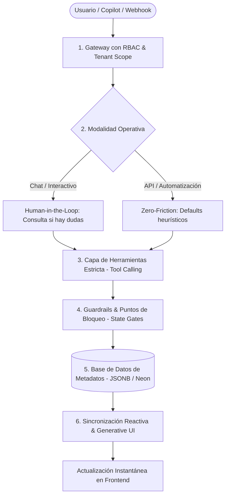

# 🏛️ Metodología de Arquitectura Agéntica y SaaS Extensible

> **Estándar de Ingeniería para el Ecosistema Kônsul**  
> *Aplica para: Process, Bills, LeadsHUB, CRM, Agentes y futuros micro-SaaS.*  
> Autor: Kônsul Architecture & AI Engineering · Versión: 2.0 (Actualizada)

---

## 1. Visión y Filosofía

El principio rector del ecosistema Kônsul es:  
**"El software trabaja para el usuario, no el usuario para el software."**

En los SaaS tradicionales, cuando un usuario necesita un nuevo tipo de flujo, un checklist particular, un campo adicional o un cambio de comportamiento, tiene dos opciones: adaptarse a la rigidez del sistema o solicitar un desarrollo a medida en el código fuente.

Esta metodología define cómo construir aplicaciones donde **el usuario, o un Asistente de IA (Copilot) en su nombre, puede modelar, personalizar y construir flujos completos en tiempo real sin modificar jamás el código fuente del sistema**.

---

## 2. Los 6 Pilares de la Arquitectura



---

### Pilar 1: Motor Basado en Metadatos (Metadata-Driven Engine)
El código base (core) de las aplicaciones actúa como un **intérprete** y no como un almacén de reglas estáticas.

* **El Core es Agnóstico:** El frontend renderiza componentes leyendo esquemas guardados en base de datos; el backend procesa eventos siguiendo las definiciones almacenadas.
* **Persistencia en JSONB:** Las entidades altamente variables (etapas de un pipeline, pasos de un proceso, checklists de verificación, criterios de semáforo, reglas de cobro) se modelan en columnas `JSONB` en PostgreSQL.
* **Inmutabilidad del Código:** Modificar un proceso, agregar un paso con checklist o crear un nuevo estado consiste únicamente en mutar un documento en la base de datos de la organización, garantizando que el código de la app permanezca 100% inalterado y compartido (Multi-tenant SaaS).

---

### Pilar 2: Aislamiento Multi-inquilino e Inyección de Contexto (Tenant Context Injection)
Cada usuario opera estrictamente en su propio entorno aislado.

* **Scoping Obligatorio en Base de Datos:** Ninguna herramienta ejecutada por la IA puede recibir o decidir el `organization_id` o `user_id` desde el LLM. El backend siempre inyecta el `tenant_id` validado a partir de la sesión autenticada (JWT o API Key).
* **Context Injection en el System Prompt:** Para que el agente tome decisiones coherentes, en cada interacción se inyecta en su `systemPrompt` el contexto vivo del usuario:
  * Su rol y permisos (Admin, Manager, Operador).
  * Catálogos existentes en su empresa (plantillas activas, clientes registrados, miembros de equipo).
  * Reglas de negocio vigentes de su cuenta.

---

### Pilar 3: Catálogo Estricto de Herramientas (Tool Calling & Function Calling)
La IA no tiene acceso libre a la consola, ni escribe sentencias SQL directas, ni ejecuta código arbitrario.

* **API Gateway de Herramientas:** La IA solo interactúa mediante un catálogo de funciones bien tipadas (ej. `create_process_template`, `create_invoice`, `add_client_checklist_item`).
* **Validación de Esquema:** Cada herramienta define sus parámetros esperados con esquemas estrictos (JSON Schema o Zod). Si los parámetros no cumplen la estructura, la ejecución se rechaza en el backend antes de llegar a la base de datos.
* **Trazabilidad (Audit Trail):** Cada mutación realizada vía agente almacena metadatos de autoría:
  ```json
  {
    "created_by": "agent",
    "triggered_by_user_id": 42,
    "agent_session_id": "copilot-sess-9823",
    "timestamp": "2026-10-04T18:00:00Z"
  }
  ```

---

### Pilar 4: Doble Modalidad Operativa (Human-in-the-Loop vs. Zero-Friction Headless)
Una misma capacidad agéntica debe poder ser consumida en dos entornos radicalmente distintos:

| Criterio | Modo Asistido / Chat (Copilot / UI) | Modo Automatización (Webhooks / API v1) |
| :--- | :--- | :--- |
| **Audiencia** | Usuario interactuando en pantalla | Tareas programadas, Zapier, Webhooks, APIs |
| **Ante incertidumbre o datos faltantes** | **Pregunta de inmediato:** Solicita aclaración en el chat antes de asumir. | **Nunca pregunta:** Utiliza valores por defecto seguros y heurísticas. |
| **Confirmación de cambios críticos** | Muestra vista previa interactiva (`TemplatePreviewModal`, etc.) | Ejecuta directamente y retorna reporte de resultado en JSON. |
| **Objetivo principal** | Co-creación y precisión con el usuario | Cero fricción, resiliencia y ejecución desatendida |

> **Regla de Oro:** Si un webhook o integración de fondo se topa con un agente que "se queda esperando una respuesta del usuario", el pipeline completo se cuelga. En flujos automáticos, el agente **siempre procede con defaults estructurados**.

---

### Pilar 5: Guardrails de Negocio y Puntos de Bloqueo (State Gates & Checklists)
La libertad de construcción no debe generar caos operativo. Las aplicaciones deben implementar **compuertas condicionales**:

* **Checklists Dinámicos como Bloqueadores (`is_blocking: true`):**
  * Los checklists no son simples notas visuales. Si un ítem se marca como bloqueante, la ejecución del proyecto, la emisión de una factura o el avance de un lead se detiene físicamente hasta que dicho requisito se satisfaga.
* **Validación de Máquina de Estados:** Un proceso no puede avanzar al estado "Completado" si existen pasos obligatorios o entregables pendientes sin archivo adjunto verificado.
* **Fallback Seguro:** Si la IA genera una estructura errónea o incompleta, los guardrails del backend sanitizan los datos aplicando valores de reserva seguros.

---

### Pilar 6: UI Generativa y Sincronización Reactiva (Server-Driven UI & Event Bus)
El frontend debe reaccionar de forma instantánea a las acciones del agente sin recargas manuales:

1. **Tarjetas de Acción Generativa en el Chat:** La IA responde con componentes visuales enriquecidos (ej. tarjeta de confirmación con enlaces al nuevo proceso, botón de previsualización o resumen de impacto).
2. **Bus de Eventos Interno (Event-Driven State Invalidation):** Cuando una herramienta agéntica muta el backend, emite una señal que los componentes escuchan para refrescar sus datos en segundo plano:
   ```javascript
   // Notificación global de cambio tras ejecución agéntica
   window.dispatchEvent(new CustomEvent('konsul:entity-updated', { 
     detail: { entity: 'process_instance', id: newId } 
   }));
   ```
3. **Optimistic UI:** Actualización inmediata en el estado del cliente mientras el backend confirma la persistencia.

---

## 3. Estructura de Código Estándar para Replicar en Apps

Para replicar este estándar en **KônsulBills**, **KônsulLeadsHUB**, **KônsulCRM** o cualquier otra app, estructurar el código siguiendo este patrón:

### 3.1 Backend (`/api/agent/`)

```
/api/
  _auth.js                    ← Validación de sesión JWT o x-api-key
  agent/
    index.js                  ← Endpoint POST /api/agent/chat
    systemPrompt.js           ← Constructor del prompt con inyección de contexto
    tools.js                  ← Declaración de tools (schemas Gemini/OpenAI)
    executor.js               ← Ejecutor seguro de herramientas con tenant scoping
    suggest.js                ← Endpoints específicos (ej. /api/ai/suggest-checklist)
  v1/                         ← Endpoints REST estándar para automatizaciones
```

#### Ejemplo de Declaración de Herramienta (`tools.js`):
```javascript
export const agentTools = [
  {
    name: "create_record",
    description: "Crea un nuevo registro en el módulo especificado para la organización.",
    parameters: {
      type: "OBJECT",
      properties: {
        title: { type: "STRING", description: "Título o nombre principal" },
        category: { type: "STRING", description: "Categoría de la entidad" },
        metadata: { 
          type: "OBJECT", 
          description: "Campos dinámicos adicionales en formato clave-valor" 
        },
        checklist: {
          type: "ARRAY",
          description: "Lista de verificaciones o micro-tareas necesarias",
          items: {
            type: "OBJECT",
            properties: {
              text: { type: "STRING" },
              isBlocking: { type: "BOOLEAN", description: "Si bloquea el cierre del registro" }
            },
            required: ["text"]
          }
        }
      },
      required: ["title"]
    }
  }
];
```

#### Ejemplo de Ejecutor Seguro con Tenant Scoping (`executor.js`):
```javascript
export async function executeAgentTool(toolName, args, userContext) {
  // SEGURIDAD: Inyección obligatoria del tenant validado en la sesión
  const organizationId = userContext.organizationId;
  const userId = userContext.userId;

  switch (toolName) {
    case "create_record":
      return await db.records.create({
        organizationId, // NUNCA permitir que la IA decida el tenant
        createdBy: userId,
        createdVia: 'agent',
        title: args.title,
        category: args.category || 'General',
        metadata: args.metadata || {},
        checklist: (args.checklist || []).map(item => ({
          id: crypto.randomUUID(),
          text: item.text,
          isCompleted: false,
          isBlocking: !!item.isBlocking
        }))
      });
    default:
      throw new Error(`Herramienta no reconocida: ${toolName}`);
  }
}
```

---

## 4. Matriz de Aplicación en el Ecosistema Kônsul

| Aplicación | Entidad Extensible (Metadata JSONB) | Rol de las Herramientas Agénticas | Puntos de Bloqueo / Guardrails |
| :--- | :--- | :--- | :--- |
| **Kônsul Process** *(Implementado)* | Plantillas, pasos, checklists de verificación, semáforo de clientes | Crea plantillas con IA, audita tiempos límite, asigna tareas a colaboradores | Checklists bloqueantes en clientes detienen el avance de procesos activos |
| **Kônsul Bills** | Reglas de cobro, conceptos dinámicos en factura, retenciones por país | Genera facturas desde lenguaje natural, calcula impuestos, envía recordatorios | No permite emitir factura si falta aprobación contable o datos fiscales validados |
| **Kônsul LeadsHUB** | Etapas del embudo, campos de calificación de leads, reglas de scoring | Califica prospectos, asigna leads por especialidad de asesor, redacta seguimiento | No permite transferir lead a "Cierre" sin verificar checklist de datos de contacto |
| **Kônsul CRM** | Historial de interacciones, perfiles de cuenta enriquecidos, acuerdos | Resume reuniones, programa tareas de postventa, detecta riesgo de abandono (churn) | Alerta temprana si una cuenta clave no tiene actividad en N días |

---

## 5. Checklist de Verificación para Nuevas Apps

Antes de dar por implementada la Arquitectura Agéntica en un micro-SaaS de Kônsul, verificar los siguientes 8 puntos:

- [ ] **1. Inmutabilidad:** ¿Los usuarios pueden crear o modificar flujos/entidades sin tocar el código fuente?
- [ ] **2. Almacenamiento JSONB:** ¿Las propiedades y configuraciones dinámicas están almacenadas en estructuras JSONB en PostgreSQL?
- [ ] **3. Tenant Scoping Blindado:** ¿Las herramientas del agente inyectan obligatoriamente el `organization_id` y `user_id` desde el token verificado y nunca desde los argumentos del LLM?
- [ ] **4. Doble Modalidad:** ¿El agente pregunta cuando tiene dudas en el chat interactivo, pero usa defaults seguros sin detenerse en webhooks/automatizaciones?
- [ ] **5. Guardrails & Bloqueos:** ¿Existen puntos de bloqueo (`is_blocking`) y validaciones que impidan estados inconsistentes?
- [ ] **6. UI Generativa:** ¿El frontend renderiza tarjetas interactivas o actualiza el estado automáticamente tras la acción del asistente?
- [ ] **7. Trazabilidad:** ¿Cada registro o acción creada por la IA guarda auditoría (`created_by: 'agent'`, `triggered_by_user_id`)?
- [ ] **8. APIs v1 Idénticas:** ¿Las mismas capacidades que tiene la IA están expuestas a través de endpoints REST en `/api/v1/` para integraciones entre apps del ecosistema?
