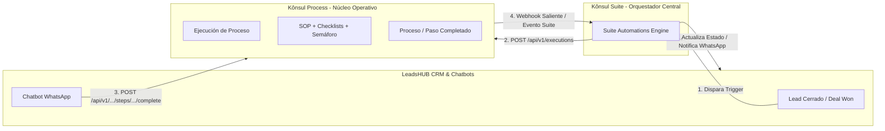

# 🔌 Guía de Integración API: Kônsul Process + Kônsul Suite + LeadsHUB CRM

> **Estándar de Interoperabilidad del Ecosistema Kônsul**  
> *Conexión bidireccional entre CRM (LeadsHUB), Orquestador (Suite) y Núcleo Operativo (Process).*  
> Versión: 2.0 (Actualizada)

---

## 1. Arquitectura de Conexión: El Rol de Kônsul Suite



1. **LeadsHUB** gestiona el trato comercial y la interacción conversacional por WhatsApp/Web.
2. **Kônsul Suite** es el cerebro orquestador que escucha eventos entre herramientas y conecta sus APIs.
3. **Kônsul Process** ejecuta la operatividad real: asegura que los pasos, checklists y entregables se cumplan.
4. **Al avanzar o completar un proceso**, Process notifica a Suite en tiempo real (`triggerProcessAutomation`), permitiendo que Suite actualice el estado del cliente en LeadsHUB o emita una factura en Bills.

---

## 2. Autenticación

Todas las solicitudes a la API de Process deben incluir la clave de API (`x-api-key`) mediante alguno de los siguientes métodos:

- **Header Recomendado:** `x-api-key: kp_live_tu_clave`
- **Header Authorization:** `Authorization: Bearer kp_live_tu_clave`

> Las API Keys se generan desde **Ajustes → API & Integraciones** en Process y soportan tokens de servicio del ecosistema Kônsul.

---

## 3. Catálogo de Endpoints REST (`/api/v1/...`)

### 3.1 Plantillas de Procesos

#### `GET /api/v1/templates`
Devuelve el catálogo de plantillas operativas aprobadas para que Suite o LeadsHUB sepan qué flujos están disponibles para detonar.

---

### 3.2 Ejecuciones Operativas (Instances)

#### `GET /api/v1/executions`
Lista las ejecuciones de procesos con filtros opcionales por cliente y columna Kanban.

* **Query Params:**
  * `client_id` (opcional): Filtra por ID de cliente.
  * `status` (opcional): Filtra por estado (ej. `Por hacer`, `En curso`, `Terminado`).
  * `limit`, `offset`: Paginación.

* **Respuesta:**
```json
{
  "success": true,
  "data": [
    {
      "id": "inst_a1b2c3d4e5f6",
      "templateId": "tmpl_onboarding",
      "title": "Onboarding de Cliente",
      "instanceName": "Acme Corp - Despliegue",
      "clientId": "leadshub_9823",
      "status": "En curso",
      "priority": "Alta",
      "startedAt": "2026-10-10T10:00:00.000Z",
      "totalSteps": 5,
      "completedSteps": 2,
      "progressPercentage": 40
    }
  ]
}
```

---

#### `POST /api/v1/executions` (Iniciar Proceso)
Inicia un nuevo flujo operativo asignado a un cliente. Hereda automáticamente los checklists y duraciones configuradas en la plantilla.

* **Payload:**
```json
{
  "templateId": "tmpl_onboarding",
  "instanceName": "Acme Corp - Despliegue",
  "clientId": "leadshub_9823",
  "clientName": "Acme Corp",
  "priority": "Alta",
  "variables": {
    "empresa": "Acme Corp",
    "asesor": "Carlos Mendoza"
  }
}
```

* **Respuesta (201 Created):**
```json
{
  "success": true,
  "data": {
    "id": "inst_a1b2c3d4e5f6",
    "title": "Onboarding de Cliente",
    "instanceName": "Acme Corp - Despliegue",
    "clientId": "leadshub_9823",
    "status": "Por hacer",
    "totalSteps": 5,
    "steps": [ ... ]
  }
}
```

---

#### `GET /api/v1/executions/:id`
Consulta el detalle completo de una ejecución, incluyendo porcentaje de avance, el paso actual pendiente y checklists de cada tarea.

---

#### `POST /api/v1/executions/:id/steps/:stepId/complete`
Permite a LeadsHUB o a Suite marcar un paso como completado programáticamente (por ejemplo, cuando un cliente sube un documento o llena un formulario por WhatsApp).

* **Payload:**
```json
{
  "completedBy": "Bot WhatsApp LeadsHUB",
  "notes": "Cliente envió el contrato firmado vía WhatsApp.",
  "uploadedFileName": "contrato_firmado.pdf",
  "uploadedFileUrl": "https://storage.konsul.digital/docs/contrato.pdf"
}
```

* **Efecto:**
  * Marca el paso como completado con fecha y autor.
  * Dispara el evento a Suite: `'Paso de Tarea Completado'`.
  * Si era el último paso, actualiza la tarjeta a `Terminado` y dispara: `'Proceso Completado'`.

---

### 3.3 Clientes y Semáforo de Salud Operativa

#### `GET /api/v1/clients`
Lista los clientes sincronizados con su semáforo de calidad (`trafficLight`: `green`, `yellow`, `red`), porcentaje de checklist y cantidad de ejecuciones activas.

---

#### `POST /api/v1/clients`
Sincroniza o actualiza un cliente con su checklist de requerimientos.

* **Payload:**
```json
{
  "id": "leadshub_9823",
  "name": "Acme Corp"
}
```

---

#### `GET /api/v1/clients/:id/executions`
Permite a LeadsHUB mostrar en el perfil del cliente dentro del CRM todas las ejecuciones activas y completadas que tiene en Process.

---

#### `GET /api/v1/summary`
Resumen de salud operativa global para el dashboard de Suite:
* Total de ejecuciones activas y desglose por columnas Kanban.
* Porcentaje global de cumplimiento de pasos.
* Conteo de clientes por semáforo (Verde / Amarillo / Rojo).

---

## 4. Webhook de Entrada de LeadsHUB (`POST /api/v1/leadshub`)

Configura esta URL en el módulo de Webhooks de LeadsHUB:
`https://tu-process.vercel.app/api/v1/leadshub`

### Eventos soportados:
1. **`lead.created` / `contact.created`:**
   Sincroniza al contacto en el directorio de clientes de Process con ID `leadshub_{id}`.
2. **`deal.won` / `process.start`:**
   Inicia automáticamente la plantilla de proceso asociada, vincula al cliente y dispara el flujo en el Kanban.

---

## 5. Eventos Salientes hacia Kônsul Suite (`triggerProcessAutomation`)

Process emite automáticamente notificaciones hacia `https://suite.konsul.digital/api/v1/automations/trigger` con `appCode: 'process'`:

| Evento / Trigger Name | Cuándo se dispara | Datos enviados a Suite |
| :--- | :--- | :--- |
| **`Nueva Tarea / Tarjeta`** | Al iniciar cualquier proceso | ID, Título, Plantilla, Cliente, Asignado |
| **`Estado de Tarea Cambiado`** | Al mover tarjeta en el Kanban | ID, Título, Columna Actual (ej. "En curso") |
| **`Paso de Tarea Completado`** | Al completar un paso con checklist | ID de Ejecución, ID de Paso, Título del Paso |
| **`Proceso Completado`** | Al finalizar el 100% de los pasos | ID, Título, Cliente, Plantilla, Fecha Fin |

Estos eventos permiten que **Kônsul Suite** ejecute acciones automatizadas en LeadsHUB (ej. cambiar etiqueta del lead a *Servicio Entregado*) o en Bills (ej. emitir factura de balance).
